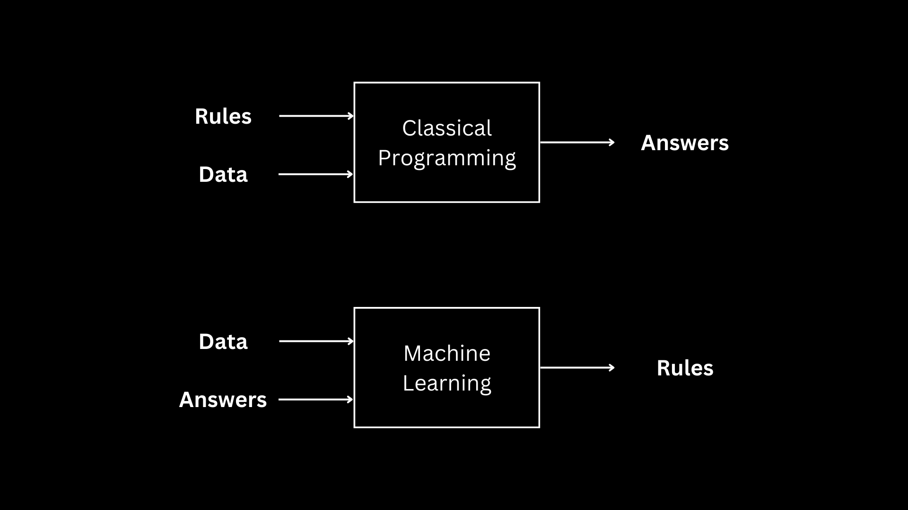

# Developer Road Map

With the recent boom of AI in products and services, I see a lot of developers wanting to learn how to build AI into their applications.

The difficult part about learning machine learning as a developer is the mindset for building applications programmatically and using AI is different. [Francois Chollet](https://twitter.com/fchollet) represents this change of thinking in a diagram in his [‘Deep Learning with Python’](https://www.manning.com/books/deep-learning-with-python-second-edition?a_aid=keras&a_bid=76564dff) book:

Instead of telling a program what to do, machine learning engineers use data and answers to help a program learn what to do on its own. It allows code to tackle complex problems that would be difficult to program but also requires engineers to understand the way machine learning algorithms come to their outputs. This means understanding unpredictability in:

* Program output
* Privacy
* Testing
* Reliability

All things programmers are used to dealing with in a predictable manner.

Learning the math behind machine learning is required to effectively build ML into products. I recommend developers follow the [Machine Learning Engineer Road Map](mle_road_map.md) while skipping the coding-focused prerequisites as needed.

However, I know devs like to build things (myself included) so here's a building-first approach to using ML that'll take you through many of the resources in the MLE Road Map.

## Find a problem

Pick a problem you want to solve using a LLMs. This can be a specific use-case you have in mind or automating something in your workflow.

Try to solve that problem using only ChatGPT (you don't even have to subscribe to Plus). See what you're able to and where it's weak. You'll really quickly realize the limitations to solving problems via an ML chat bot.

Next, hook into the [OpenAI API](https://openai.com/blog/openai-api) and use your developer skills to build something using that API to solve the same problem. Make sure to spend some time [reading the docs](https://platform.openai.com/docs/introduction) (I know, blasphemy). I see too many devs without AI experiencing thinking the open way GPT-4 is making some sort of chat bot.

After building something using the AI, you'll have a good understanding of what it's capable of and the costs involved in using it to build.

## Start Learning Machine Learning

This is the point where it's worth learning more about machine learning. This knowledge will help you take open source models and fine-tune them to work for your specific purpose. This works much better for building ML applications than you larger, more generic models.

This is where you should follow the [Machine Learning Engineering Road Map](mle_road_map.md). It'll take you through machine learning principles from an engineering perspective as you go through [Google's Machine Learning Crash Course](https://developers.google.com/machine-learning/crash-course/framing/video-lecture). It'll cover most of the considerations for building with machine learning. With a developer background, you'll be able to skip most of the prerequisites.

## Learning More

If you really like this and want to learn more about ML math, you can check of the [Modeling Road Map](modeling_road_map.md). It'll run through [CS299](../CS229/cs229.md) taught by [Andrew Ng](https://www.andrewng.org/), a very well-respected name in the field of machine learning.

You can also check out the [tools](../tools.md) and [resources](../topics.md) guides for further information on machine learning. All three are a WIP with more info coming soon.

## Support this guide

Don't forget to star this repo and [following me on X](https://x.com/loganthorneloe) to support this guide.